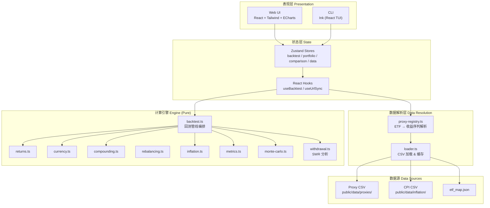

# Lazy Portfolio — 项目架构文档

## 概述

Lazy Portfolio 是一个投资组合回测分析工具，支持**双 UI（Web + CLI）**，共享同一套纯函数式回测引擎。用户可构建/选择投资组合，设定参数后运行历史回测，获得收益、风险、蒙特卡洛模拟、安全提款率（SWR）等分析结果。

- **Web UI**: React 19 + Vite 7 + Tailwind CSS 4 + ECharts 6
- **CLI**: Ink 7 (React 终端 UI 框架)
- **语言**: TypeScript (strict mode)
- **状态管理**: Zustand 5
- **测试**: Vitest
- **国际化**: i18next (en / zh)

---

## 目录结构

```
lazy_portfolio/
├── public/                     # 静态资源 & 数据文件
│   └── data/
│       ├── etf_map.json        # ETF → 代理数据 映射表
│       ├── data_version.json   # 数据版本清单
│       ├── proxies/            # 历史代理数据 CSV
│       │   ├── equity/         #   股票
│       │   ├── bond/           #   债券
│       │   ├── commodity/      #   商品
│       │   ├── real_estate/    #   房地产
│       │   └── fx/             #   外汇
│       └── inflation/          # CPI 通胀数据 (US/CN/EU/JP/UK)
│
├── scripts/                    # 数据获取 & 验证脚本
│   ├── fetch-shiller-data.ts   # 从 FRED/Shiller 拉取数据
│   ├── scrape-templates.ts     # 抓取投资组合模板
│   ├── generate-proxy-data.ts  # 生成代理数据
│   ├── validate-proxies.ts     # 验证代理数据
│   ├── blend-etf-data.ts       # 混合 ETF 实际数据
│   └── ...
│
├── src/
│   ├── engine/                 # ★ 核心引擎 — 纯计算，无副作用
│   ├── data/                   # 数据加载层 (浏览器端)
│   ├── stores/                 # Zustand 状态管理
│   ├── components/             # Web UI 组件
│   ├── cli/                    # CLI 终端 UI
│   ├── hooks/                  # React Hooks
│   ├── workers/                # Web Worker
│   ├── i18n/                   # 国际化
│   ├── lib/                    # 通用工具库
│   ├── benchmarks/             # 内置基准定义
│   └── portfolios/             # 投资组合模板注册表 (自动生成)
│
├── docs/                       # 项目文档
├── AGENTS.md / CLAUDE.md       # AI 协作者指南
├── vite.config.ts
├── vitest.config.ts
└── package.json
```

---

## 架构分层



---

## 核心引擎 (`src/engine/`)

引擎是**纯函数式**的，无浏览器/Node API 依赖，所有数据由调用方注入。

### 回测管线 (`backtest.ts`)

`runBacktest(params, assetReturns, fxRates, cpiSeries)` 执行完整的 8 步管线：

```
1. 构建月度网格        buildMonthGrid(start, end)
2. 对齐收益 + 货币转换  alignReturnsToGrid → convertReturnSeries (if FX needed)
3. 确定有效起始月       findEffectiveStartIndex
4. 展开定期现金流       expandCashflows
5. 复利计算 + 再平衡    compoundPortfolio (含 per-asset 跟踪)
6. 构建时间序列         buildTimeSeries (含回撤跟踪)
7. 通胀调整             adjustForInflation (可选)
8. 计算指标             computeMetrics
```

### 模块说明

| 文件 | 职责 |
|------|------|
| `types.ts` | 所有类型定义：资产、组合、参数、结果、指标等 |
| `returns.ts` | 月度收益计算 (`computeMonthlyReturns`) 与网格对齐 (`alignReturnsToGrid`) |
| `currency.ts` | 外汇转换：`convertReturn(return, fxCurr, fxPrev)` → `(1+r)×(fx_t/fx_{t-1})-1` |
| `compounding.ts` | 组合复利计算：逐月对每项资产应用收益，支持再平衡 & 现金流注入 |
| `rebalancing.ts` | 再平衡触发判断：日历型 (monthly/quarterly/annual)、容差带型 (tolerance band) |
| `inflation.ts` | CPI 通胀调整：名义值 → 实际值，缺值月份前向填充 |
| `metrics.ts` | 指标计算：CAGR/TWR、Sharpe、Sortino、最大回撤、滚动收益、偏度/峰度 |
| `monte-carlo.ts` | 蒙特卡洛模拟：从历史月度 TWR 采样，模拟未来 N 年路径 |
| `withdrawal.ts` | SWR 分析：遍历所有历史起始月份，计算提款成功率 & 安全提款率 |

### 关键设计约定

- **收益粒度**: 月度。时间序列日期为月末 `YYYY-MM-DD`；用户输入用 `YYYY-MM`。
- **权重**: 0.0–1.0（非百分比）。
- **缺失数据处理**: 初期缺失数据推动有效起始日后移；起始后的缺失视为数据错误。
- **现金流**: `cashflowImpact` = 实际应用的现金流（受限于可用资本），`cashflowRequested` = 计划现金流。
- **通胀调整**: 调整后 `portfolioValue` / `monthlyReturn` 为实际值，名义值保留在 `*Real` 字段（历史命名遗留）。
- **蒙特卡洛**: 从 `monthlyReturn` (TWR) 采样，跳过初始点。不从组合价值变化推导（现金流会污染增量）。
- **SWR**: 使用月度起始期，需要完整的退休窗口 (`start + retirementYears × 12` 个月度点)。

---

## 数据流

### Web 端

```
用户操作
  → Zustand Store (参数变更)
  → useBacktest Hook
  → resolvePortfolioReturns()  // 加载 proxy CSV → 计算月收益 → 扣减 ER
  → resolveFxRates()           // 加载外汇数据
  → resolveCpiSeries()         // 加载 CPI 数据
  → Web Worker (或主线程) 执行 runBacktest()
  → 结果写回 Store → UI 更新
```

### CLI 端

```
CLI 参数输入
  → resolvePortfolioData()     // Node fs 读取 CSV → 扣减 ER
  → runBacktest()              // 主线程直接调用（CLI 不需要 Worker）
  → 结果用 asciichart 渲染终端图表
```

### 数据加载差异

| 方面 | Web | CLI |
|------|-----|-----|
| 数据源 | `fetch(/data/...)` | `fs.readFileSync` |
| 缓存 | 内存 Map | 无（CLI 单次运行） |
| ER 处理 | proxy-registry 按需扣减 | data-resolver 统一扣减 |
| 计算线程 | Web Worker (可 fallback 主线程) | 主线程 |

---

## 状态管理

### Zustand Stores

| Store | 职责 | 持久化 |
|-------|------|--------|
| `backtest-store` | 回测参数、结果、状态、LRU 缓存(20条) | localStorage |
| `portfolio-store` | 当前组合、已保存组合列表 | localStorage |
| `comparison-store` | 最多 4 个比较槽位 | localStorage |
| `data-store` | ETF 映射表、数据版本 | 无（运行时加载） |

### URL 同步

`useUrlSync` Hook 将回测参数序列化到 URL query string，支持可分享链接。

---

## Web UI 组件树

```
App
├── BrowserRouter
│   └── AppShell
│       ├── Navbar (导航栏)
│       └── Routes
│           ├── / → PortfolioBuilder
│           │       ├── EtfSelector (ETF 筛选 & 选择)
│           │       └── WeightEditor (权重编辑)
│           ├── /backtest → BacktestPage
│           │       ├── ParameterForm (参数: 日期/本金/货币/通胀/再平衡)
│           │       ├── CashflowEditor (现金流: 定投/提款)
│           │       ├── ComparisonPanel (基准对比选择)
│           │       ├── ComparisonTable (多组合对比表)
│           │       ├── ResultsDashboard (指标仪表盘)
│           │       ├── EquityCurveChart (净值曲线)
│           │       ├── MultiEquityChart (多组合净值对比)
│           │       ├── AnnualReturnsChart (年度收益柱状图)
│           │       ├── DrawdownChart (回撤曲线)
│           │       ├── RollingReturnsChart (滚动收益)
│           │       ├── ScatterChart (风险/收益散点图)
│           │       └── MonteCarloChart (蒙特卡洛模拟)
│           ├── /templates → TemplatesPage
│           └── /templates/:id → TemplateDetail
```

### 图表组件

全部基于 ECharts 6 (`echarts-for-react`)，主要图表：

| 图表 | 文件 | 说明 |
|------|------|------|
| 净值曲线 | `EquityCurveChart.tsx` | $10k 增长曲线，含回撤填充区域，支持刷选缩放 |
| 多组合对比 | `MultiEquityChart.tsx` | 2+ 条净值曲线叠加对比 |
| 年度收益 | `AnnualReturnsChart.tsx` | 柱状图，绿涨红跌 |
| 回撤曲线 | `DrawdownChart.tsx` | 水下面积图 |
| 滚动收益 | `RollingReturnsChart.tsx` | 3/5/10 年滚动 CAGR 折线 |
| 散点图 | `ScatterChart.tsx` | 风险-收益气泡分析 |
| 蒙特卡洛 | `MonteCarloChart.tsx` | 百分位路径扇区图 + 终值分布直方图 |

---

## CLI 架构

CLI 使用 Ink 构建终端 UI，状态机式视图切换：

```
Views: home → select → portfolio → params → running → results
                                              ↓
                                         swr_params → swr_running → swr_results
```

终端图表使用 asciichart 库渲染 ASCII 折线图。自定义组合和偏好设置保存在 `~/.lazy-portfolio/`。

---

## Web Worker

`src/workers/backtest.worker.ts` 将 `runBacktest()` 包装在 Web Worker 中，使重计算不阻塞主线程。`useBacktest` Hook 自动检测 Worker 可用性，不可用时回退到主线程执行。

---

## 投资组合模板

`src/portfolios/registry.ts` 由 `scripts/scrape-templates.ts` 自动生成，包含 ~170 个来自 lazyportfolioetf.com 的投资组合模板。每个模板包含 ID、名称、描述、持仓及标签。

---

## 基准测试 (Benchmarks)

`src/benchmarks/definitions.ts` 定义内置对比基准：

| ID | 名称 | 构成 |
|----|------|------|
| `sp500` | S&P 500 | 100% SP500_TR |
| `6040` | 60/40 组合 | 60% SP500_TR + 40% US_10Y_TR |
| `us_bonds` | 美国综合债券 | 100% US_AGG_BOND_TR |
| `cash` | 现金 (T-Bills) | 100% CASH |
| `gold` | 黄金 | 100% GOLD_SPOT |

---

## 国际化

- 语言: English (`en`) / 中文 (`zh`)
- Web UI: `useTranslation()` Hook
- 语言选择: localStorage 持久化，默认跟随浏览器语言

---

## 关键技术决策

1. **引擎纯函数化**: 所有计算无副作用，方便测试和跨平台复用
2. **月度粒度**: 平衡数据精度与历史数据可用性（部分 proxy 只有月度数据）
3. **Proxy 数据架构**: ETF 映射到长期历史代理指数，解决 ETF 成立时间短的问题
4. **混合数据**: `_BLENDED` 后缀的 CSV 混合了 ETF 实际价格（含 ER）与代理指数，减少 ER 高估问题
5. **Web Worker**: 回测可能涉及数十年月度数据 + 蒙特卡洛模拟，Worker 保证 UI 不卡顿
6. **LRU 缓存**: 参数不变时避免重复计算，缓存 key 含 dataVersion 以便数据更新时自动失效
7. **构建分块**: echarts 和 portfolio registry 分别打入独立 chunk，优化首屏加载

---

## 引擎层测试覆盖率

### 总体指标

| 指标 | 覆盖率 |
|------|--------|
| Statements | **96.01%** (651/678) |
| Branches | **81.17%** (263/324) |
| Functions | **97.39%** (112/115) |
| Lines | **97.69%** (551/564) |

> 测试文件 9 个，测试用例 74 个，全部通过。

### 逐文件详情

| 文件 | Stmts% | Branch% | Funcs% | Lines% | 未覆盖行 |
|------|--------|---------|--------|--------|----------|
| `returns.ts` | 100 | 100 | 100 | 100 | — |
| `inflation.ts` | 100 | 100 | 100 | 100 | — |
| `types.ts` | — | — | — | — | (纯类型定义) |
| `compounding.ts` | 98.57 | 93.54 | 100 | 98.36 | 27 (空输入早期返回) |
| `backtest.ts` | 97.52 | 74.62 | 100 | 100 | 220-225, 244, 263-294 |
| `metrics.ts` | 96.64 | 80.30 | 97.05 | 97.39 | 13, 160, 309 (空输入/边界分支) |
| `withdrawal.ts` | 96.26 | 78.57 | 100 | 99.12 | 115 (CPI 缺失时的 fallback) |
| `currency.ts` | 94.73 | 93.10 | 75.00 | 97.14 | 66 (空 FX 序列早期返回) |
| `rebalancing.ts` | 93.54 | 75.86 | 100 | 95.83 | 19, 93 (空输入 + 未知策略 fallback) |
| `monte-carlo.ts` | 86.79 | 37.50 | 88.88 | 88.09 | 28, 45, 112-114 (空输入/空数据路径) |

### 未覆盖代码分析

| 文件:行号 | 代码 | 原因 |
|-----------|------|------|
| `backtest.ts:220-225` | `findEffectiveStartIndex` 中 `return -1` | 仅当所有 holdings 完全无有效数据时触发 |
| `backtest.ts:244` | `assertNoMissingReturnsAfterStart` 内层循环 | 仅当数据对齐后仍有 null 时触发 (报错路径) |
| `backtest.ts:263-294` | `computeReturnDistribution` 各桶计数分支 | 间接覆盖(验证了 total count)，但各桶的条件分支未被独立测试 |
| `compounding.ts:27` | `nMonths===0 \|\| nAssets===0` 早期返回 | 空输入边缘情况 |
| `currency.ts:66` | `fxRates.length===0 → months.map(() => null)` | 空 FX 序列 |
| `metrics.ts:13` | `n===0 → emptyMetrics()` | 空时间序列 |
| `metrics.ts:160` | `values.length===0` 分支 | 空 value 数组时的 maxDrawdown 计算 |
| `metrics.ts:309` | `returns.length < months → return {0,0}` | 序列太短无法构成完整滚动窗口 |
| `monte-carlo.ts:28` | `timeSeries.length < 12` | 不足一年的数据 |
| `monte-carlo.ts:45` | `monthlyReturns.length===0` | 过滤后无有效收益 |
| `monte-carlo.ts:112-114` | `getPercentile` 空数组返回 0 | 空终值数组 |
| `rebalancing.ts:19` | `nAssets===0 \|\| nMonths===0` 返回 `[]` | 空输入 |
| `rebalancing.ts:93` | `checkRebalanceTrigger` 中 `return false` | 未知策略类型 (TypeScript 类型系统保证不会执行到) |
| `withdrawal.ts:115` | `yearCPI` 为 null 时 `amount = -initialWithdrawal` | CPI 数据缺失时使用名义金额 |

### 建议

大部分未覆盖代码是**防御性早期返回**和**边缘情况分支**，对正常功能无影响。优先级最高的补充测试：

1. **monte-carlo.ts** — 补充 `<12 个月` 和空 `monthlyReturns` 分支测试
2. **compounding.ts** — 补充空 assets/空 months 边界测试
3. **rebalancing.ts** — 补充空输入边界测试
4. **computeReturnDistribution** — 补充不同收益区间的桶分配测试
